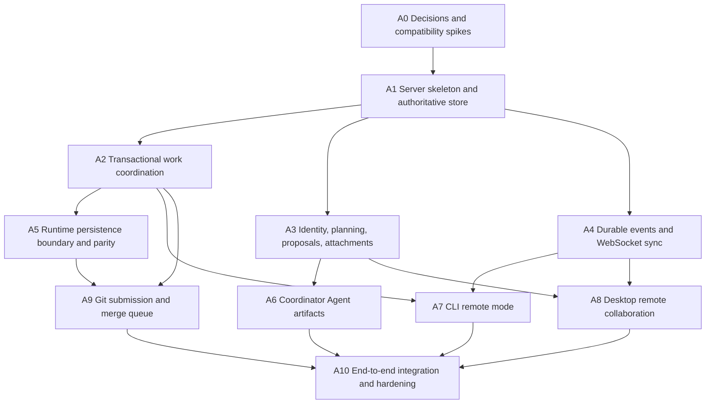

# Implementation: LAN Multi-User Collaboration and Server-Coordinated Delivery

> Decision: see `RFC.md` §Summary and §Rationale and Alternatives. This file references, rather than restates, RFC goals and scope.

## Resolved Questions (were open in RFC.md)

| Open question | Resolution | Evidence | Confidence |
|---|---|---|---|
| Human schema/security owner | Project owner (user) is the named schema/security approver. | User designation on 2026-07-12; approval required for public server API or schema migrations. | accepted |
| First topology | One server hosts multiple projects; each project binds to zero or one Git repository. | Preserves current multi-project discovery while keeping merge ownership singular; owner may narrow it without changing storage ports. | accepted |
| SQLite driver/migrations | `node:sqlite` (`DatabaseSync`) plus server-owned numbered SQL migrations. | A0 spike and rollback: `ADR-001-authoritative-sqlite.md`. Selection does not affect runtime public APIs. | accepted |
| HTTP/WebSocket implementation | Dedicated `node:http` collaboration listener plus `ws` 8.x; existing MCP listener retains `/mcp`. | A0 spike and rollback: `ADR-002-http-websocket-transport.md`; public wire contracts: `CONTRACTS-v1.md`. | accepted |
| Coordinator Agent provider | Start with an internal provider interface and a manual/fake provider used by integration tests. Enable the first real provider only after cancellation, budget, and artifact-source persistence exist. | Existing runtime already isolates executors through integration interfaces under `packages/runtime/src/autoRun/` | likely |
| PostgreSQL trigger | Deferred until observed need: revisit if sustained write lock wait or deployment topology prevents meeting KPI guardrails for two review windows | First release intentionally targets a single LAN server | n/a |

## Approach

Implement the modular server in vertical, reversible slices. Establish storage and command semantics before real-time UI or Agent automation. Keep local mode green after every merge. Work packages below are the units to assign to Agents; an Agent owns its named paths unless an integration package explicitly grants overlap.

## Agent Work Packages and Dependency Graph

Parallelizable after A1: A2, A3, and A4. After their prerequisites: A6, A7, A8, and part of A9. A5 must coordinate closely with A2 and cannot independently change shared runtime mutation contracts.

## Steps (dependency-ordered)

### A0 — Decisions and compatibility spikes

**Owner:** Architecture Agent. **Allowed paths:** `.octocode/rfc/lan-multi-user-collaboration/`, temporary spike files under `packages/server`; no production API.

- [x] Record named schema/security approver: project owner (user).
- [x] Record topology decision: one server hosts multiple projects; each binds zero or one Git repository.
- [x] Compare SQLite candidates on Node ESM, transactions, migrations, test isolation, macOS/Linux/Windows install, and desktop packaging impact (`ADR-001-authoritative-sqlite.md`).
- [x] Compare a dedicated collaboration HTTP/WebSocket stack with extending the narrow Node HTTP server; preserve `/mcp` compatibility (`ADR-002-http-websocket-transport.md`).
- [x] Write ADRs with rollback and retain no non-selected spike code.
- [x] Freeze error envelope, cursor, idempotency, optimistic version, and event envelope contracts (`CONTRACTS-v1.md`).

**Acceptance:** ADR rollback is complete. `node:sqlite` selection has no package dependency. A1 must add selected pure-JS `ws` to its new server package and prove `pnpm install --frozen-lockfile`, server typecheck/build, and macOS/Linux/Windows CI before this acceptance gate is fully closed; A0 is prohibited from creating that production package.

**A0 verification record (2026-07-12):** Node `v24.14.0` completed an in-memory SQLite `BEGIN IMMEDIATE`/`COMMIT` smoke test; a temporary ESM `ws` `8.21.0` package completed a loopback Node HTTP upgrade/message handshake; the existing workspace passed `pnpm install --frozen-lockfile` and `git diff --check`. The temporary package was outside the repository and removed from the implementation surface.

### A1 — Server skeleton and authoritative store

**Owner:** Storage/Server Agent. **Allowed paths:** `packages/server/**`, workspace package metadata. **Depends on:** A0.

**A1 status (2026-07-12):** implemented server package foundation with `node:sqlite`, numbered schema migration v1, WAL/foreign-key/busy-timeout setup, explicit write transactions, health/readiness listener, idempotency/event/audit atomic unit of work, and safe SQLite backup foundation. The public collaboration endpoints and WebSocket synchronization remain A2–A4 work.

- [ ] Add `@planweave-ai/server` with config, lifecycle, health/readiness, structured logging, graceful shutdown, and data directory resolution.
- [ ] Add migration runner and schema for projects, memberships, idempotency, domain events, and audit log.
- [ ] Enable WAL, foreign keys, busy timeout, explicit write transactions, and schema version checks.
- [ ] Implement unit-of-work and repository contracts inside the server package.
- [ ] Commit domain change, idempotency result, event, and audit row atomically.
- [ ] Add startup reconciliation hooks and database export/backup command foundation.

**Acceptance:** concurrent command tests, restart tests, migration upgrade/rollback-fixture tests, and idempotent replay tests pass.

### A2 — Transactional work coordination

**Owner:** Work Coordination Agent. **Allowed paths:** `packages/server/src/work/**`, corresponding tests and schemas. **Depends on:** A1.

- [ ] Model task binding, dependency snapshot, assignment, lease, heartbeat, submission, review, and state transitions.
- [ ] Implement conditional task claim in one transaction with one active assignment constraint.
- [ ] Validate dependency readiness and existing PlanWeave parallel/lock policy before assignment.
- [ ] Implement lease expiry/reclaim without deleting branches or submissions.
- [ ] Implement versioned commands and deterministic conflict responses.
- [ ] Expose application services independently of HTTP handlers.

**Acceptance:** a barrier-synchronized test issuing at least 20 claims for one task produces exactly one active assignment; repeated submit/heartbeat commands are idempotent.

### A3 — Identity, planning, proposals, and attachments

**Owner:** Collaboration Domain Agent. **Allowed paths:** `packages/server/src/{identity,planning,proposals,attachments}/**`. **Depends on:** A1.

- [ ] Add users, devices, invitation redemption, revocable sessions, and `owner/maintainer/contributor/viewer` authorization.
- [ ] Add planning rooms and immutable messages.
- [ ] Implement staged attachment upload, digest verification, content-addressed promotion, project authorization, and limits.
- [ ] Add versioned coordinator artifacts and artifact-to-source citations.
- [ ] Add immutable proposal revisions and revision-keyed approvals.
- [ ] Enforce approval policy transactionally on project state transition.

**Acceptance:** changing a proposal invalidates the previous approval set; unauthorized blob access fails; duplicate content is deduplicated without sharing authorization across projects.

### A4 — Durable events and client synchronization

**Owner:** Realtime Agent. **Allowed paths:** `packages/server/src/events/**`, transport handlers and tests. **Depends on:** A1.

- [ ] Publish committed domain events to authenticated WebSocket subscribers.
- [ ] Use monotonically ordered durable event IDs and per-aggregate versions.
- [ ] Add `events-after` and project snapshot APIs for reconnect/gap recovery.
- [ ] Apply bounded subscriber queues, heartbeat, slow-consumer disconnect, and authorization changes.
- [ ] Ensure notification loss cannot lose state because clients can resync.

**Acceptance:** integration tests drop, duplicate, and reorder client-visible notifications and still converge after snapshot/event replay.

### A5 — Runtime persistence boundary and local parity

**Owner:** Runtime Agent. **Allowed paths:** `packages/runtime/src/**` and runtime tests only. **Depends on:** A2 contract freeze.

- [ ] Inventory state-changing runtime entry points before editing; introduce the smallest repository/unit-of-work ports around claim, submit, review, and status transitions.
- [ ] Keep existing exported function signatures and `FileRuntimeRepository` behavior.
- [ ] Add deterministic domain transition functions where server transactions need calculation without file I/O.
- [ ] Ensure server collaboration metadata remains outside Plan Package schemas in this RFC.
- [ ] Add parity fixtures asserting file-backed and transactional adapters produce equivalent domain transitions.

**Acceptance:** all existing runtime tests remain green; local CLI/MCP/Desktop compile unchanged; parity suites cover claim, parallel conflict, submit, review feedback, block/diverge/retry.

### A6 — Coordinator Agent and consensus artifacts

**Owner:** Agent Orchestration Agent. **Allowed paths:** `packages/server/src/agents/**`; prompt/contracts tests. **Depends on:** A3.

- [ ] Define provider-neutral run, cancellation, budget, retry, and structured-output contracts.
- [ ] Consume only messages/attachments added after the last artifact checkpoint plus current structured artifacts.
- [ ] Require every artifact claim to reference source IDs; reject invalid source references.
- [ ] Generate brief, requirements, constraints, ADR candidates, open questions, risk register, and task-allocation proposal.
- [ ] Keep human approval as a server command unavailable to the Agent identity.
- [ ] Provide manual/fake provider for deterministic tests before enabling a real provider.

**Acceptance:** the Agent cannot approve a proposal; artifact output with missing/foreign citations is rejected; cancellation and restart leave a recoverable run state.

### A7 — CLI remote mode

**Owner:** CLI Agent. **Allowed paths:** `packages/cli/**`; shared API client package only if created by A1. **Depends on:** A2 and A4 stable contracts.

- [ ] Add named server profiles and secure per-device credential storage strategy.
- [ ] Add `server start`, `join`, `project`, `task claim`, `task heartbeat`, `task checkout`, `task submit`, and `merge-queue status` flows.
- [ ] Preserve current local command behavior unless a remote profile/project is explicitly selected.
- [ ] Make command retries use stable idempotency keys and clear conflict messages.
- [ ] Ensure `task checkout` creates a normal branch without destructive Git operations.

**Acceptance:** CLI E2E covers two users joining, one winning a claim, local branch creation, submission, reconnect, and credential revocation.

### A8 — Desktop remote collaboration

**Owner:** Desktop Agent. **Allowed paths:** `packages/desktop/**`; no runtime mutation changes. **Depends on:** A3 and A4 stable contracts.

- [ ] Add local/remote connection profiles in Electron main settings.
- [ ] Keep credentials and network access behind preload; expose typed, minimal renderer methods.
- [ ] Add planning room, attachments, artifact/source inspection, approval UI, member presence, assignments, and merge status.
- [ ] Render remote project snapshots on existing graph surfaces where possible.
- [ ] Replace remote filesystem watching with event invalidation and snapshot resync; preserve local watchers for local mode.
- [ ] Follow renderer DOM boundary rules and add per-file jsdom declarations to component tests.

**Acceptance:** two Desktop clients observe proposal/task changes after reconnect; stale revision approval is visibly rejected; local mode smoke remains unchanged.

### A9 — Git submission and merge queue

**Owner:** Git Integration Agent. **Allowed paths:** `packages/server/src/git/**`, isolated CLI integration hooks, tests/fixtures. **Depends on:** A2 and A5.

- [ ] Manage a bare integration repository and disposable worktrees using argument-array process execution.
- [ ] Validate immutable base/head commits, ancestry, membership, assignment, and changed ownership scopes.
- [ ] Run targeted task checks first; retain logs and structured evidence.
- [ ] Run Agent/human review policy; enqueue only approved immutable heads.
- [ ] Prepare candidates concurrently but serialize target mutation with a final target-head check.
- [ ] Run `pnpm lint`, `pnpm -r build`, and `pnpm test` before final merge unless a stricter repository policy is configured.
- [ ] Reconcile interrupted queue entries on restart and garbage-collect only unreferenced worktrees.

**Acceptance:** conflict, stale target, path violation, failing check, process crash, and successful merge scenarios are covered without losing contributor commits.

### A10 — End-to-end integration and hardening

**Owner:** Integration Agent. **Allowed paths:** cross-package tests, docs, CI, release packaging; product changes require relevant owner review. **Depends on:** A6-A9.

- [ ] Add a seeded LAN collaboration fixture and multi-client E2E suite.
- [ ] Exercise planning, proposal revision approval, task allocation, concurrent claim, local submit, review feedback, re-submit, and merge.
- [ ] Add authorization matrix, input limits, path traversal, command injection, WebSocket backpressure, migration, backup/restore, and crash recovery tests.
- [ ] Add operator documentation for bind address, TLS/recommended overlay network, backup, restore, upgrade, and incident freeze.
- [ ] Run the full repository validation chain and desktop smoke/package checks appropriate to touched targets.
- [ ] Update KPI traceability status with evidence.

## Files / APIs / Contracts Touched

- `packages/runtime/src/state.ts:27-37` — file repository remains; mutation ports are introduced behind current entry points.
- `packages/runtime/src/taskManager/claimScheduler.ts:28-99` — transition logic becomes separable from file persistence; no big-bang rewrite.
- `packages/runtime/src/taskManager/selectors.ts:161-189` — reuse dependency/lock conflict semantics.
- `packages/mcp/src/server.ts:108-153` — preserve `/mcp`; introduce an explicit remote application gateway rather than embedding collaboration state here.
- `packages/mcp/src/toolRuntime.ts:67-89` — gateway pattern is extended to select local runtime or server client.
- `packages/desktop/src/preload/preload.ts:19-48` — extend typed bridge for remote events/API without renderer credentials.
- `packages/desktop/src/main/runtimeBridgeHandlerRegistry.ts:306-380` — local mode remains; remote handlers use server client.
- `packages/cli/src/index.ts` — register remote/server command groups without changing local defaults.
- `package.json:8-33` — add server scripts and preserve check order.

## Agent Coordination Rules

1. Each Agent works on a dedicated branch/worktree and only its allowed paths.
2. A0 freezes shared contracts before A1; A1 freezes repository/event/error contracts before dependent work begins.
3. Shared contract changes require a small contract PR reviewed by every affected package owner; feature Agents do not independently fork DTOs.
4. Runtime Agent owns runtime public APIs. Server Agent owns database schema and transaction semantics. Integration Agent may not silently resolve domain disagreements.
5. Every PR states prerequisite work package, touched contract version, commands run, and remaining blockers.
6. Merge order follows the dependency graph. Parallel Agents rebase after prerequisite merges and rerun targeted checks.
7. Generated code, lockfile changes, and migration files have a single named owner per merge window.

## Risk Mitigations

- Use uniqueness constraints and conditional writes in addition to application checks.
- Treat events as durable invalidations and snapshots as recovery truth.
- Keep proposal revisions immutable and approvals non-transferable.
- Prevent Agent identities from invoking human approval or privileged merge commands.
- Use typed process invocation, disposable worktrees, immutable commits, and serialized target updates.
- Feature-gate remote mode and keep file-backed mode as rollback.
- Reject oversized queues/uploads/messages early and instrument database lock wait, event lag, and merge duration.

## Test and Verification Plan (V&V)

| Type | Scope | Approach | Command |
|------|-------|----------|---------|
| Unit | Server domain/state machines | Table-driven transitions and authorization matrix | `pnpm --filter @planweave-ai/server vitest run` |
| Concurrency | Claims/idempotency/versions | Barrier-synchronized parallel requests against real SQLite | server focused test file |
| Runtime parity | Local versus transactional transitions | Shared fixtures for claim/submit/review | `pnpm --filter @planweave-ai/runtime vitest run` |
| API integration | HTTP, WebSocket, auth, resync | In-process server and multiple clients | server integration suite |
| Git integration | Bare repo/worktrees/queue/recovery | Temporary repositories and failure injection | server Git suite |
| CLI E2E | Join/claim/checkout/submit | Spawn CLI against temporary server | `pnpm --filter @planweave-ai/cli vitest run` |
| Desktop | Remote hooks/components/local regression | jsdom plus Electron smoke | desktop test/build/smoke scripts |
| Security | Auth, traversal, injection, upload policy | Negative matrix and fuzz/property inputs where useful | server security suite |
| Full regression | Monorepo | Existing CI order | `pnpm lint && pnpm -r build && pnpm test` |

## Rollout / Migration / Rollback

- **Sequencing:** ship server behind an experimental flag; validate with a disposable repository; run a maintainer-only pilot; then enable invited LAN members. Local mode remains default through the first stable cycle.
- **Flags/gating:** remote connection profiles require explicit creation; project state can be frozen read-only; merge queue can be paused independently of discussion and reads.
- **Data migration:** new collaboration projects begin in SQLite. Existing Plan Packages are linked/imported without deleting or rewriting their current state files.
- **Rollback trigger:** any duplicate active assignment, lost accepted command after acknowledged success, unauthorized artifact/blob read, or target branch update without a fully passed immutable submission immediately freezes mutations and merge processing.
- **Rollback action:** stop new writes, retain database/audit/Git branches, export a project snapshot, drain no additional merge entries, and switch clients back to local mode.
- **Owner/approver:** project owner must name the server schema/security approver before A1's public contract merges.

## References

- `RFC.md` — decision SSOT.
- `PREREQUISITES.md` — baseline and gates.
- `RESOURCES.md` — source inventory.
- `packages/runtime/src/taskManager/claimScheduler.ts:28-99` — current non-transactional claim boundary.
- `packages/runtime/src/taskManager/selectors.ts:161-189` — existing concurrency policy to preserve.
- `packages/mcp/src/config.ts:99-108` — existing non-loopback authentication guard.
- `packages/desktop/src/main/runtimeStateWatch.ts:182-203` — local invalidation pattern that remote events replace only in remote mode.
