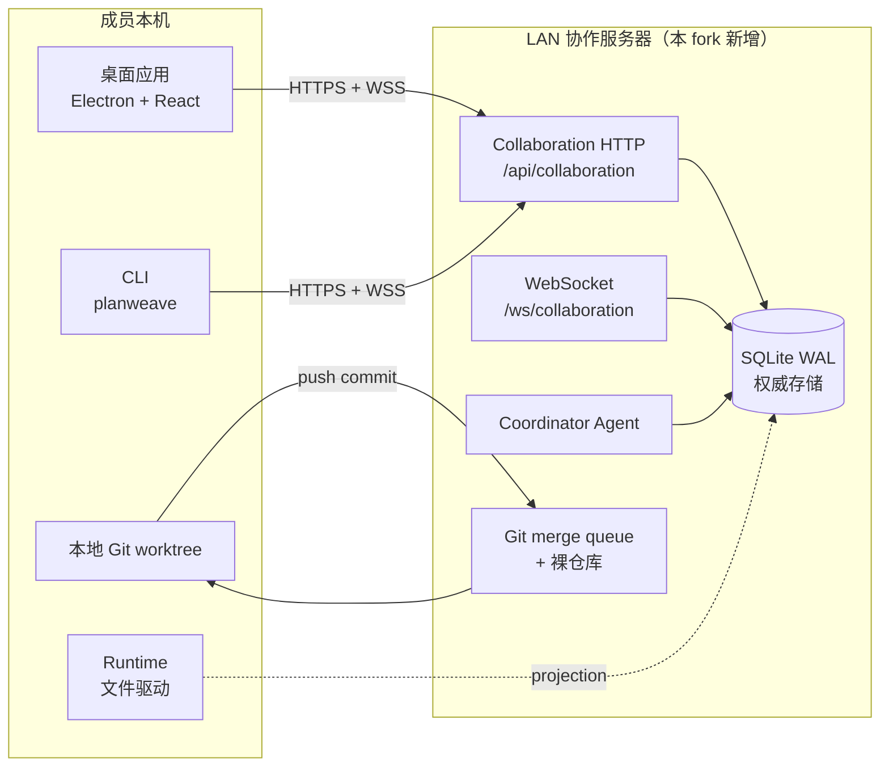

<h1 align="center">PlanWeave — LAN 团队协作 Fork</h1>

<p align="center">
  为 PlanWeave 增加的、服务器协调的多人协作层，配 Codex 风格的桌面端外壳。
  本 fork 在 upstream 单机文件驱动的循环之上，新增了权威状态、身份、提案、Work lease、事件流与 Git merge queue。
</p>

<!-- planweave-badges:start -->
<p align="center">
  
  
  
  
  
  
</p>
<!-- planweave-badges:end -->

---

## 0. 相对 upstream 做了哪些改动

> 上游基线：`GaosCode/PlanWeave` @ `6a5dbb1 docs(readme): mention skills in quick start`。
> 本 fork：领先 20 个 commit，**+15,553 / −155 行，142 个文件**。

| 范围 | 改动 | 代码位置 |
|---|---|---|
| **新增 `packages/server`** | axum + `node:sqlite` (WAL) 权威协调器。八个内部模块：`identity` / `planning` / `proposals` / `work` / `events` / `agents` / `git` / `audit`。独立的 HTTP `/api/collaboration` 监听 + WebSocket 同步。 | `packages/server/src/**` |
| **事务性 work 协调** | 任务、assignments、leases、heartbeat、submissions、reviews。通过 partial unique index 强制"每个任务同一时刻只有一个 active assignment"不变量。Lease 过期回收。Idempotency key + `expectedVersion` 乐观并发。 | `packages/server/src/work/` |
| **身份与会话** | 用户、设备、邀请码、可吊销的 session、项目成员。Token 化加入。 | `packages/server/src/identity/` |
| **规划室与提案** | 规划室、消息、附件元数据、不可变的提案修订、审批策略、投票、生命周期跃迁。 | `packages/server/src/{planning,proposals,attachments}/` |
| **持久事件 + WebSocket** | 仅追加的 `domain_events`，通过 `ws 8.x` 暴露 `EventEnvelopeV1` 投影。支持断线重连的 resync cursor。 | `packages/server/src/events/` |
| **Git merge queue** | 裸集成仓库 + 隔离 worktree。所有权路径校验（拒绝 `events-rogue/**` 这类前缀歧义）。串行合并，依次走身份 / 祖先 / 路径 / 检查 / Agent / 人工 评审。 | `packages/server/src/git/` |
| **Runtime parity** | `packages/runtime` 在写入边界拆出 `FileRuntimeRepository` ↔ `SqliteRuntimeRepository`，让服务端模式是 source of truth，文件模式照常工作。 | A5 commit |
| **Coordinator Agent** | artifact / checkpoint 持久化、取消、重试。可插拔 provider 接口；首个真实 provider 需等待持久化工作就绪。 | `packages/server/src/agents/` |
| **CLI 远程模式** | `planweave server start\|join\|list\|forget\|project`、`planweave remote task\|merge-queue` 等。 | `packages/cli/src/commands/remote*.ts` |
| **桌面端 Team Mode** | 内嵌 Mode 切换（Personal / Team）。Host / Member 角色选择；本机 `localTeamHost` 一键启服务；连接 profile；规划室、提案、事件同步；角色徽章。 | `packages/desktop/src/renderer/team/`、`packages/desktop/src/main/localTeamHost.ts` |
| **Codex 风格 UI 整改** | 紧凑常驻侧栏 + brand header；Personal/Team 模式切换 + 角色徽章；向上弹出 Settings 下拉（5 个分区）；可拖拽的浮动组件面板 + 悬停展开；`view-enter` 路由过渡；语义化色彩 token（亮 / 暗 / 跟随系统）。 | `packages/desktop/src/renderer/{sidebar,AppSidebars,AppSettingsRoute,views,index.css}` |
| **i18n zh-CN** | 覆盖率达到 **98.8%**，附动画。 | `packages/desktop/src/renderer/i18nZhCn.ts` |
| **worktree 残留清理延后** | `.worktrees/` 下的 A1–A9 worktree 仍在（已合入 main）。 | follow-up |

upstream 原始的 README 不再是本 fork 的真相来源。旧的 zh-CN 译文见 `readme/README.zh-CN.md`。

---

## 1. 架构



### 权威模型

- **服务器是协作状态的唯一写入者**。所有写操作都在显式 `BEGIN IMMEDIATE` 事务里跑。
- 每个聚合都带单调递增的 `version`。过期命令会以 `version_conflict` 失败。
- 每个客户端命令都带 `idempotencyKey`（16–128 个 ASCII 字符）。重放会返回缓存结果。
- 领域行写入 + idempotency 行 + `domain_events` 追加 + `audit_log` 追加共用一个事务（见 `packages/server/src/store.ts:executeIdempotent`）。
- Runtime 领域逻辑**不允许 import 服务端**。`packages/runtime` 写入边界拆为 `FileRuntimeRepository`（默认）与 `SqliteRuntimeRepository`（server 模式）。A1–A5 在每次 merge 后保持单机模式仍可跑。

### 服务端模块（`packages/server/src/`）

| 模块 | 职责 |
|---|---|
| `identity/` | 用户、设备、邀请码、session、成员、权限 |
| `planning/` | 规划室、消息、附件元数据、artifact 引用 |
| `proposals/` | 不可变修订、审批策略、投票、生命周期 |
| `work/` | 任务、assignment、lease、heartbeat、submission、review、reclaim |
| `events/` | 持久事件流、WebSocket publisher、resync cursor、HTTP 可用性 |
| `agents/` | coordinator run、输入输出、预算、取消、重试 |
| `git/` | 裸仓库、worktree 生命周期、ownership 校验、merge queue、check |
| `audit/` | 仅追加的动作历史 |
| `attachments/` | 上传元数据、digest、size 检查、BOLA 防护 |
| `collaborationApi.ts` | 八个模块的 HTTP 路由 |
| `lifecycle.ts` | `startPlanweaveServer`、启动 reconciliation、优雅关停 |
| `store.ts` | SQLite handle、migrations runner、`executeIdempotent` |
| `config.ts` | 环境变量驱动的配置、端口 / 数据目录 / join token / busy timeout |

### 桌面端分层

```
┌─────────────────────────────────────────────────────────────────┐
│  侧栏                                              │
│  ├─ PlanWeave brand 头 + 折叠 / 后退 / 前进                     │
│  ├─ Mode: Personal / Team（带角色徽章）                         │
│  ├─ Team 子导航（Team 模式时）：规划室 / 流程图 / 团队任务 /    │
│  │     提案 / 成员                                               │
│  ├─ 本地导航：新建任务 / 流程图 / 画布地图 / 待办 / 搜索 /      │
│  │     通知                                                       │
│  └─ 底部：设置（向上弹出下拉）/ 重置布局                        │
├─────────────────────────────────────────────────────────────────┤
│  主显示区                                                        │
│  ├─ Personal 模式 → WorkspaceTabs（graph / canvas / todo / …） │
│  ├─ 设置视图  → AppSettingsRoute（5 个分区）                     │
│  └─ Team 模式  → TeamModeShell（内嵌，占满主区）                │
│                  ├─ 选择 host / member 角色                      │
│                  ├─ 本机 team host 启动                          │
│                  └─ 当前项目 shell                                │
├─────────────────────────────────────────────────────────────────┤
│  浮动组件面板（可拖拽、悬停展开）                                │
└─────────────────────────────────────────────────────────────────┘
```

### 支持的部署形态

- **单机文件驱动** —— 原版 PlanWeave，照常工作。Runtime 走 `FileRuntimeRepository`，不需要 server。
- **LAN 多人协作** —— 一个项目对应一个 `packages/server` 实例。桌面 / CLI 通过 LAN 连接。SQLite WAL 提供权威存储；Git merge queue 串行化提交。

---
