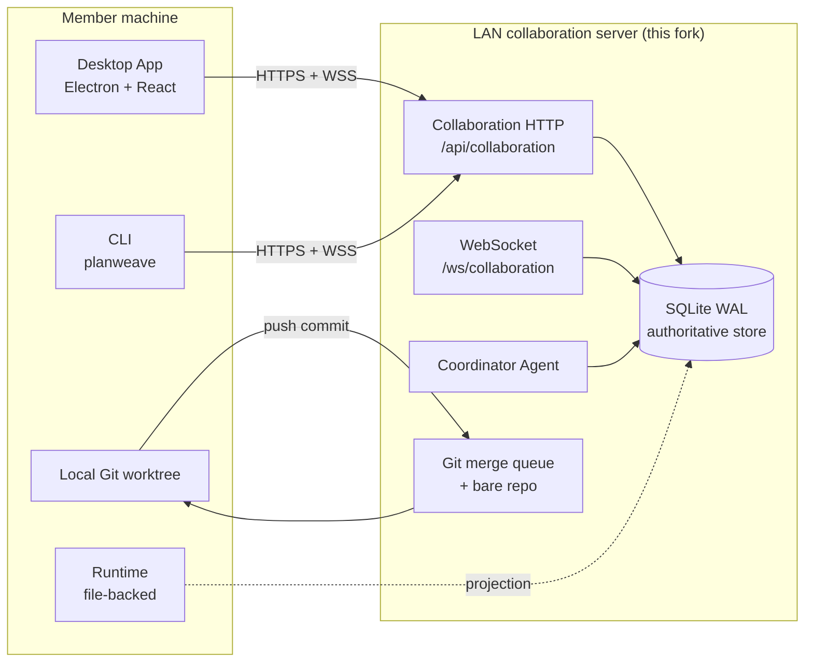

<h1 align="center">PlanWeave — LAN Team Collaboration Fork</h1>

<p align="center">
  A server-coordinated, multi-user collaboration layer for PlanWeave, with a Codex-style desktop shell.
  This fork adds authoritative state, identity, proposals, work leases, events, and a Git merge queue
  to the upstream file-backed single-user loop.
</p>

<!-- planweave-badges:start -->
<p align="center">
  
  
  
  
  
  
</p>
<!-- planweave-badges:end -->

---

## 0. What changed vs upstream

> Upstream baseline: `GaosCode/PlanWeave` @ `6a5dbb1 docs(readme): mention skills in quick start`.
> This fork: 20 commits ahead, **+15,553 / −155 lines, 142 files**.

| Area | Change | Reference |
|---|---|---|
| **New `packages/server`** | Axum + `node:sqlite` (WAL) authoritative coordinator. Eight internal modules: `identity` / `planning` / `proposals` / `work` / `events` / `agents` / `git` / `audit`. Dedicated HTTP `/api/collaboration` listener + WebSocket sync. | `packages/server/src/**` |
| **Transactional work coordination** | Tasks, assignments, leases, heartbeat, submissions, reviews. Exactly-one-active-assignment invariant enforced by partial unique index. Lease reclaim. Idempotency key + `expectedVersion` optimistic concurrency. | `packages/server/src/work/` |
| **Identity & sessions** | Users, devices, invitations, revocable sessions, project membership. Token-based join. | `packages/server/src/identity/` |
| **Planning rooms & proposals** | Rooms, messages, attachment metadata, immutable proposal revisions, approval policy, votes, lifecycle transitions. | `packages/server/src/{planning,proposals,attachments}/` |
| **Durable events + WebSocket** | Append-only `domain_events` with `EventEnvelopeV1` projection over `ws 8.x`. Reconnect-friendly resync cursor. | `packages/server/src/events/` |
| **Git merge queue** | Bare integration repo + isolated worktrees. Ownership-scope path validation (rejects `events-rogue/**` style matches). Serialized merge with identity / ancestry / scope / check / Agent / human review gates. | `packages/server/src/git/` |
| **Runtime parity** | `packages/runtime` gains a `FileRuntimeRepository` ↔ `SqliteRuntimeRepository` boundary so server mode is the source of truth while file-backed mode still works. | A5 commit |
| **Coordinator Agent** | Artifact / checkpoint persistence, cancellation, retry. Pluggable provider interface; first real provider gated on persistence work. | `packages/server/src/agents/` |
| **CLI remote mode** | `planweave server start|join|list|forget|project`, `planweave remote task|merge-queue` etc. | `packages/cli/src/commands/remote*.ts` |
| **Desktop Team Mode** | Embedded mode switch (Personal / Team). Host / member role choice, local `localTeamHost` that boots a server, connection profiles, planning rooms, proposals, event sync, role indicator badges. | `packages/desktop/src/renderer/team/`, `packages/desktop/src/main/localTeamHost.ts` |
| **Codex-style UI refinements** | Persistent compact sidebar with brand header; Personal/Team mode switch with role badge; upward Settings dropdown (5 sections); draggable floating component palette with hover-expand; `view-enter` route transitions; semantic color tokens for light/dark/system themes. | `packages/desktop/src/renderer/{sidebar,AppSidebars,AppSettingsRoute,views,index.css}` |
| **i18n zh-CN** | Coverage brought to **98.8%** with Codex-style animations. | `packages/desktop/src/renderer/i18nZhCn.ts` |
| **Worktree-residue cleanup deferred** | A1–A9 worktrees under `.worktrees/` are still present (already merged). | follow-up |

The original upstream README is no longer the source of truth for this fork. See `readme/README.zh-CN.md` for the older zh-CN reference text.

---

## 1. Architecture



### Authority model

- The **server is the only writer** of collaborative state. All state-changing use cases run inside explicit `BEGIN IMMEDIATE` transactions.
- Every aggregate carries a monotonically increasing `version`. Stale commands fail with `version_conflict`.
- Every client command carries an `idempotencyKey` (16–128 ASCII). Replays return the cached result.
- Domain row write + idempotency row + `domain_events` append + `audit_log` append all share one transaction (see `packages/server/src/store.ts:executeIdempotent`).
- Runtime domain logic never imports the server. The `packages/runtime` mutation boundary is split into a `FileRuntimeRepository` (default) and a `SqliteRuntimeRepository` (server mode). A1–A5 keep local mode green after every merge.

### Server modules (`packages/server/src/`)

| Module | Responsibility |
|---|---|
| `identity/` | users, devices, invitations, sessions, membership, authorization |
| `planning/` | rooms, messages, attachment metadata, artifact citations |
| `proposals/` | immutable revisions, approval policy, votes, lifecycle |
| `work/` | tasks, assignments, leases, heartbeat, submission, review, reclaim |
| `events/` | durable event sequence, WebSocket publisher, resync cursor, HTTP availability |
| `agents/` | coordinator runs, inputs, outputs, budgets, cancellation, retry |
| `git/` | bare repo, worktree lifecycle, ownership validation, merge queue, checks |
| `audit/` | append-only action history |
| `attachments/` | upload metadata, digest, size checks, BOLA protection |
| `collaborationApi.ts` | HTTP routes for the eight modules |
| `lifecycle.ts` | `startPlanweaveServer`, startup reconciliation, graceful shutdown |
| `store.ts` | SQLite handle, migrations runner, `executeIdempotent` |
| `config.ts` | env-driven config, port / data dir / join token / busy timeout |

### Frontend (Desktop) layers

```
┌─────────────────────────────────────────────────────────────────┐
│  Sidebar (Codex-style)                                          │
│  ├─ PlanWeave brand header + collapse / back / forward          │
│  ├─ Mode: Personal / Team  (with role badge)                   │
│  ├─ Team subnav (when Team): planning / graph / tasks /         │
│  │     proposals / members                                      │
│  ├─ Local nav: New Task / Graph / Canvas Map / Todo / Search /  │
│  │     Notifications                                            │
│  └─ Bottom: Settings (upward dropdown) / Reset Layout          │
├─────────────────────────────────────────────────────────────────┤
│  Main display region                                            │
│  ├─ Personal mode  → WorkspaceTabs (graph/canvas/todo/...)     │
│  ├─ Settings view  → AppSettingsRoute (5 sections)             │
│  └─ Team mode      → TeamModeShell (embedded, full-width)      │
│                        ├─ Choose host / member role             │
│                        ├─ Local team host boot                  │
│                        └─ Active project shell                  │
├─────────────────────────────────────────────────────────────────┤
│  Floating component palette (draggable, hover-expand)           │
└─────────────────────────────────────────────────────────────────┘
```

### Topologies supported

- **Single-user, file-backed** — original PlanWeave, still works. Runtime uses `FileRuntimeRepository`. No server required.
- **LAN multi-user** — one `packages/server` instance per project. Desktop / CLI connect over LAN. SQLite WAL provides the authoritative store; Git merge queue serializes submissions.

---

## 2. Quick Start (this fork)

### 2.1 Install

```bash
pnpm install --frozen-lockfile
pnpm -r build
```

The build order is `runtime → server/mcp → cli/desktop`.

### 2.2 Run the server (host machine)

```bash
# From the repo
pnpm --filter @planweave-ai/cli planweave server start \
  --port 8788 --data-directory ./data
```

Or, directly:

```bash
node packages/cli/dist/index.js server start --port 8788 --data-directory ./data
```

The server prints a join URL. Default join token is `planweave-local-team` (override with `--join-token` or the env var).

### 2.3 Connect a member (CLI)

```bash
planweave server join --server-url http://192.168.1.10:8788 --token planweave-local-team
planweave server list
planweave server project --profile <profile-id> --project <project-id>
```

### 2.4 Connect from Desktop

1. `pnpm --dir packages/desktop build && pnpm --dir packages/desktop start`
2. Sidebar → **Mode: Team** (or click the role badge in the existing Team entry).
3. Pick **Start as server** (boot a local team host on this machine) or **Join as member** (paste a server URL + token).
4. The role badge next to the Team label flips to `<ServerIcon />` or `<UserRoundIcon />` and stays synced.

### 2.5 Run a work package

- Open the **Work** view in Team Mode (sidebar subnav).
- Claim a task — server creates an assignment with a renewable lease.
- Code in a local Git worktree. Push the branch when ready.
- Submit the head commit; the merge queue validates scope, ancestry, identity, and runs checks before merging.

### 2.6 Personal / Local mode (unchanged)

- Sidebar → **Mode: Personal** (or click anywhere in the local nav).
- Use `planweave status`, `planweave run --once`, the desktop graph canvas, MCP tunnel, etc. — same as upstream.

---

## 3. CLI reference (this fork only)

| Command | Purpose |
|---|---|
| `planweave server start` | Boot the LAN server with local data dir |
| `planweave server join` | Register a connection profile + credentials |
| `planweave server list` | List known profiles |
| `planweave server forget` | Drop a profile + clear credentials |
| `planweave server project` | Bind the active project on a profile |
| `planweave remote task` | Inspect / claim / submit team tasks |
| `planweave remote merge-queue` | Inspect / retry queue entries |

Existing upstream CLI commands (`planweave init`, `run`, `status`, `mcp tunnel …`, `package-draft …`) work unchanged.

---

## 4. Verification

- `pnpm lint` — `check:versions` + `check:dom-boundaries` + `typecheck`
- `pnpm test` — full monorepo vitest
- `pnpm --filter @planweave-ai/desktop typecheck` — renderer + main process
- `pnpm --filter @planweave-ai/server test` — server unit + integration (11 files, 84+ tests)

A10 acceptance record: `.octocode/rfc/lan-multi-user-collaboration/A10_ACCEPTANCE.md`.

---

## 5. Design documents (this fork)

- `RFC.md` — LAN multi-user collaboration and server-coordinated delivery (the "why")
- `IMPLEMENTATION.md` — A0–A10 work package graph and ownership boundaries
- `CONTRACTS-v1.md` — frozen error envelope / cursor / idempotency / version / event envelope
- `A10_ACCEPTANCE.md` — integration, fault-injection, and security acceptance
- `TEAM_MODE_FRONTEND.md` — Team Mode product / information architecture
- `ADR-001-authoritative-sqlite.md` — `node:sqlite` selection
- `ADR-002-http-websocket-transport.md` — dedicated collaboration listener
- `KPI.md` — guardrails and what to revisit before scale-out
- `PREREQUISITES.md` / `RESOURCES.md`

These live in `.octocode/rfc/lan-multi-user-collaboration/` (gitignored on this fork, tracked alongside the codebase during the work package).

---

## 6. Known follow-ups (post-fork)

- The A2 work schema is being extended to persist `ownershipScopes`, protected scopes, reviewers, and acceptance checks, so the merge queue can enforce RFC's path-boundary policy from authoritative task data (A10 blocking gap).
- `.worktrees/a2-a4-*, server-integration/` are leftovers from the A1–A9 parallel work; safe to `git worktree remove` once main is the agreed integration surface.
- Coordinator Agent's first real provider is still gated on cancellation / budget / artifact-source persistence; manual / fake provider is what the integration tests use today.
- Ghost Security automated scan was not run during A10 (targeted manual review used as fallback); revisit before exposing the collaboration server outside loopback.

---

## License

MIT. See [LICENSE](LICENSE).
