<h1 align="center">PlanWeave</h1>

<p align="center">
  PlanWeave 是一个文件驱动的协调系统，可以把项目计划转化为可领取、可评审、可恢复的任务，并交给本地或远端 Coding Agent 协作完成。
</p>
<p align="center">
  
</p>

<p align="center">
  <a href="../README.md">English README</a>
</p>

<!-- planweave-badges:start -->
<p align="center">
  
  
  
  
  
  
</p>
<!-- planweave-badges:end -->


## PlanWeave 是什么

PlanWeave 不是从一段聊天记录开始组织工作，而是从任务本身开始。

它把项目拆成可编辑的任务图：任务是节点，执行步骤、检查、评审和反馈都是块。每个块都是可以被读取、运行、评审和追踪的文档单元。Agent 执行时拿到的不只是当前提示词，而是围绕任务流、依赖关系、项目提示词、运行记录和 Review 状态组成的完整上下文。

这让 PlanWeave 很适合复杂工程任务：并行实现、阶段检查、Review 出反馈、自动修复、继续执行、统计效率，都可以在同一个本地工作流里完成。

## 项目优势

- **文件即节点，文档即块**：任务图不是展示层，而是项目结构本身。
- **图友好**：依赖、执行顺序、Review/Feedback 循环和状态变化都可以直接在图上观察和编辑。
- **Agent 天然拥有全局视野**：执行块时能看到任务图和上下文，不只是孤立 prompt。
- **不同节点和块可指定不同 Agent**：实现块可以用 Codex，也可以把某些块交给 Claude Code、OpenCode 或 Pi，确定性检查可以交给本地命令。
- **通过 MCP 让 ChatGPT 生成计划**：把 ChatGPT 连接到 PlanWeave 本机 MCP server 或桌面端 secure tunnel 后，可以让它创建画布、任务、Blocks、Review Pipeline 和依赖关系。
- **任务流清晰、自由编辑**：节点、块、提示词、依赖和执行范围都可以调整。
- **全自动一站式完成任务流**：从 claim block、执行、记录报告、Review、生成反馈到继续修复，形成闭环。
- **Review 和反馈是一等公民**：Review block 可以产出结构化反馈，再回到实现 block 自动修复。
- **桌面端和 CLI 均支持**：可以用 Electron 图板操作，也可以用终端驱动同一个 runtime。
- **统计视图和搜索能力**：方便观察开发效率、运行历史、任务状态和项目 Todo。
- **本地优先、文件可审计**：prompt、运行记录、报告、metadata 和产物都留在本地工作区，便于检查、回滚和提交。
- **运行过程可监控**：每个 block run 会保留 stdout、stderr、report、metadata，并在可用时提供 tmux 监控入口。

default canvas 的可检查文件位于 PlanWeave workspace 内的 `canvases/default/package`、`canvases/default/state.json` 和 `canvases/default/results`。具体本地路径以 `planweave paths --json` 返回为准。

## 快速开始

PlanWeave 目前主推 CLI。桌面应用可以测试使用，但仍是实验版，且安装包未签名。

用 npm 安装 CLI：

```bash
npm install -g @planweave-ai/cli
```

也可以用 Homebrew 安装：

```bash
brew install GaosCode/tap/planweave
```

然后运行：

```bash
planweave --help
```

## MCP 与 ChatGPT 网页端生成计划

PlanWeave 内置本机 HTTP MCP server，可以让 ChatGPT 等 MCP client 直接使用 PlanWeave。MCP 工具不只是只读状态查询；它也能写计划：初始化项目、创建任务画布、添加任务和 Blocks、连接依赖、编辑 prompt、配置 Review Pipeline，并校验本地项目。

如果要在浏览器里的 ChatGPT 使用 PlanWeave，推荐通过桌面端设置。你可以使用 ChatGPT Pro 来制定计划：描述项目目标，让它生成任务图，再由 PlanWeave 写入任务画布。

1. 在桌面应用打开 **Settings -> MCP Tunnel**。
2. 下载或选择 OpenAI `tunnel-client`。
3. 填入 Tunnel ID 和 Runtime API key，然后启动 secure tunnel。
4. 在 ChatGPT 中用 Tunnel 连接方式添加 PlanWeave。

连接完成后，ChatGPT 可以读取 PlanWeave authoring rules 和 schema，根据你的项目目标生成计划，把计划写入新的任务画布，预览执行图，并在运行前校验 package。

源码级 MCP server 配置见 [Development](../DEVELOPMENT.md)。

## Agent 执行方式

PlanWeave 支持 executor profile，因此同一张任务图里可以混合使用不同执行器：

- Codex：适合实现、重构、修复等工程任务。
- Claude Code：适合通过非交互终端执行的 agent 任务块。
- OpenCode：适合需要进入 OpenCode session 的任务块。
- Pi：适合通过非交互终端执行的 agent 任务块。
- Local Review：适合确定性检查、脚本校验和结构化 Review。
- Review/Feedback 自动循环：开启后 Review 反馈可以回到实现块继续修复。

每次 block run 都会写入可追踪产物，包括 prompt、stdout、stderr、report、metadata，以及可用时的 tmux attach 命令。

## Agent Skills

仓库在 `skills/` 下提供了几个职责明确的 agent skill：

- `plan-maker`：在还没有正式 package 时，从模糊目标或少量代码上下文设计 PlanWeave 计划草案。
- `plan-importer`：从项目文档创建 PlanWeave Plan Package，并在写入前检查计划质量。
- `plan-auditor`：审查已经写好的 PlanWeave plan，检查目标覆盖、对象生命周期、契约漂移、弱 prompt 和不可验证完成条件。
- `plan-coordinator`：作为主 agent 持续推进整个 PlanWeave 执行循环，分发实现、评审和恢复任务。
- `plan-runner`：执行一个 implementation block，并产出完成报告。
- `plan-reviewer`：执行一个 review gate，并产出结构化 `passed` 或 `needs_changes` 结果。
- `plan-recovery`：诊断和恢复 stale current refs、state/results drift、blocked/diverged work 和 submit retry 混乱。

可以用 `skills` CLI 安装：

```bash
npx skills@latest add GaosCode/PlanWeave
```

## Agent 工作流

安装 skills 后，在目标项目里按这个流程使用：

1. 让 agent 创建或导入计划。

```text
Use skill: plan-maker
Create a PlanWeave plan for this project from the goal below...
```

如果已经有 PRD、roadmap、issue 或架构说明，用 `plan-importer`。

2. 让 coordinator 执行计划。

```text
Use skill: plan-coordinator
Run the current PlanWeave package. Route implementation to plan-runner, review gates to plan-reviewer, and recovery work to plan-recovery.
```

3. 让 coordinator 分发聚焦任务。

coordinator 应该一次只分配一个明确 block。实现类 agent 用 `plan-runner`；评审类 agent 用 `plan-reviewer`；异常状态或 submit retry 问题用 `plan-recovery`。

4. 需要排查时用 CLI 查看状态。

```bash
planweave status
planweave current
planweave explain <ref>
planweave doctor
```

简单任务可以由一个 agent 直接使用 `plan-runner` 完成。复杂计划建议用 `plan-coordinator` 作为主控 agent，再把子任务分给 `plan-runner`、`plan-reviewer` 或 `plan-recovery`。

## Auto Run

PlanWeave 包含一个实验性的一键执行路径：

```bash
planweave run --once
planweave run --reset --force --reason "重新执行验收" --step-limit 20
planweave reset --force --reason "清理旧的手动执行状态"
planweave run-sessions
planweave run-session SESSION-0001
planweave run-status
```

Auto Run 可以领取任务、调用执行器、收集运行产物、继续 review-feedback 循环，并把每次 run/reset 记录成 session。`planweave reset` 只清理 runtime state；它和初始化时重写 package source 的 `planweave init --reset-package` 不是一回事。

cron 风格的定时运行建议设置步数上限，并在运行后查看 session。下面的示例可以直接放进 crontab：

```bash
0 9 * * * cd /path/to/project && planweave run --reset --canvas default --force --reason "scheduled run" --step-limit 10 --json >> ~/.planweave-cron.log 2>&1
```

运行后可以查看 session：

```bash
planweave run-sessions --json
```

它仍是实验性功能：调度、执行器集成和异常恢复行为可能不稳定。不要直接把它当成无人值守的稳定执行入口，运行后应检查 `planweave run-status`、`planweave run-session <session-id>` 和生成的 run 产物。

## 手动 CLI 工作流

多数用户应该通过 skills 驱动 PlanWeave。手动 CLI loop 更适合调试、演示或自己接入 agent：

```bash
planweave init --json
planweave validate --json
planweave current
planweave claim-next --dry-run
planweave prompt T-001#B-001
planweave submit-result --canvas default T-001#B-001 --report report.md
```

Review gate 和 feedback loop 也可以手动提交：

```bash
planweave submit-review --canvas default T-001#R-001 --result review-result.json
planweave submit-feedback --canvas default --report feedback-report.md
```

PlanWeave 默认从当前 shell 目录解析目标项目 root。包管理器可能设置 `INIT_CWD`，PlanWeave 会优先使用它，再使用 `cwd`。如果需要从其他目录操作目标项目，把全局选项放在子命令前：

```bash
planweave --project-root /path/to/project status --json
planweave --project-root /path/to/project claim-next --canvas desktop
```

当调度原因不清楚时，先用 `planweave explain <ref>`、`planweave why-not <ref>` 和 `planweave doctor` 诊断，再考虑修改 package 或 state 文件。

## 实验性桌面应用

桌面应用目前是实验性版本，适合试用可视化任务图谱、配置给 ChatGPT 使用的 MCP tunnel，并在执行前检查生成出来的计划；正式工作流仍建议优先使用 CLI。

可以直接安装 GitHub Releases 里的安装包。当前桌面安装包未签名。macOS 可能提示无法验证开发者，Windows 可能提示未知发布者或 SmartScreen 风险。macOS 早期测试时可以通过 **右键 -> 打开** 启动应用，并在系统提示里确认。

仓库结构、源码开发、测试和本地打包命令见 [Development](../DEVELOPMENT.md)。

## 未来方向

PlanWeave 还处在早期阶段，后续可以从几个方向继续提升基于计划的 Agent 工作流体验：

- **优化 Auto Run 体验和稳定性**：让自动执行更容易理解、监控、暂停、恢复、排错，也更值得信任，同时提升调度正确性、失败恢复和长时间运行稳定性。
- **多人协作任务图板**：让多人可以共同编辑同一个任务画板，一起调整计划结构，并把协作形成的计划决策转化为可执行 block。
- **跨主机协调**：PlanWeave 现在已经支持把不同 block 路由给不同的本地 agent 或 executor profile。未来的 coordinator 可以让远端 Agent Host 注册能力、通过 lease 领取计划块、上报 heartbeat，并安全提交产物，从而让前端、评审、runtime、文档等专业 agent 跑在不同机器上。

## 开发

贡献者环境、仓库结构、测试命令和本地打包说明见 [Development](../DEVELOPMENT.md)。

## License

MIT。详见 [LICENSE](../LICENSE)。
